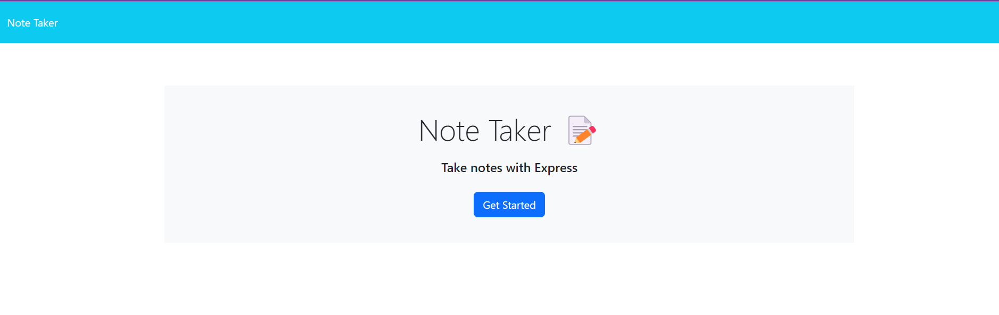

  
  # Note-Taker

  ## Description
  
  This app allows the user to take notes, and to access those notes anywhere they have an internet connection if the user deploys it using a service such as heroku.
  
  ## Table of Contents 
  
  - [Installation](#installation)
  - [Usage](#usage)
  - [Questions](#questions)
  
  ## Installation
  
  For local testing, ensure both node and npm are installed, clone the repo, then travel to the repo's root directory using bash, and run the command "npm run start" in the terminal.
  
  ## Usage
  
  If using the app locally, after following installation instructions, open your browser and insert "http://localhost:3001/" in the address bar to travel to the home page. Then click on the "Get Started" button, which sends you to the notes page. If you currently have any notes, said notes will be loaded in the left bar, and you can click on them to access the contents. If you would like to create a new note, if you haven't opened a note yet, you should be able to write into the blank note on the right, but if you have opened a note, there should be a "New Note" button on the top right which will open the note writting screen. Once you are satisfied with your note, click the "Save Note" button on the top right, or click on the "Clear Form" button in the same area if you would like to reset the contents if your in-progress note.  
  [Live Site](https://note-taker-kev-rod43-2601bdbc0590.herokuapp.com/)  
  

  
  ## License

  Note Taker is available under the MIT-0 license.
  For more information on the license, visit this [link](https://opensource.org/license/MIT-0/
  )
  
  ## Questions
  
  For any questions, feel free to contact me through either of these options: 
  
  -[Github](https://github.com/kev-rod43)
  
  -Email: kev.rod43@yahoo.com
